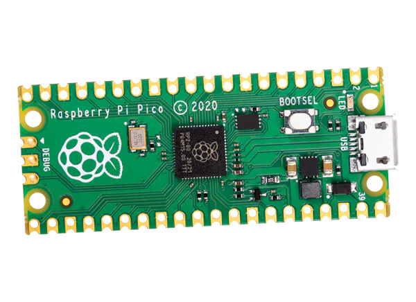

# Mouse Jiggler with Random Movements

This project implements a mouse jiggler using a microcontroller with an external button and an onboard LED. The mouse jiggler simulates mouse movements to prevent the computer from going idle. The movements are random within a specified range to mimic natural mouse activity.

## Features

- **Random Mouse Movements**: The mouse jiggler moves the mouse cursor randomly within a range of [-10, 10] units in both x and y directions.
- **Button Control**: An external button connected to the microcontroller toggles the mouse jiggler on and off.
- **Onboard LED Indicator**: The onboard LED indicates the status of the mouse jiggler.

## Hardware Requirements

- A microcontroller with an onboard LED (e.g., Raspberry Pi Pico)
- An external button connected to the microcontroller (e.g., connected to GPIO pin GP22)
- USB HID support (for mouse emulation)

## Software Requirements

- `adafruit-hid` library
- `asyncio` library

## Wiring

- Connect the external button to GPIO pin GP22 and ground.

## Code Explanation

### Initialization

- The onboard LED is configured as an output.
- The external button is configured as an input with a pull-up resistor.
- The `Mouse` object from `adafruit_hid.mouse` is initialized to simulate mouse movements.

### Main Functionality

- **Button Handling**: The button press toggles the state of the mouse jiggler.
- **Mouse Jiggler**: When activated, the mouse jiggler moves the mouse cursor randomly within a range of [-10, 10] units in both x and y directions. The movement is repeated at regular intervals.

### Asynchronous Loop

- The program runs two asynchronous tasks: one for handling the button press and one for running the mouse jiggler loop.

## Usage

1. **Setup**: Connect the button to the microcontroller as described in the wiring section.
2. **Run the Program**: Upload the code to the microcontroller and run it.
3. **Control the Mouse Jiggler**: Press the button to start or stop the mouse jiggler. The onboard LED will indicate the status.

## Issues with the install or support for other platforms?
Open an issue on GitHub and it might be fixed.